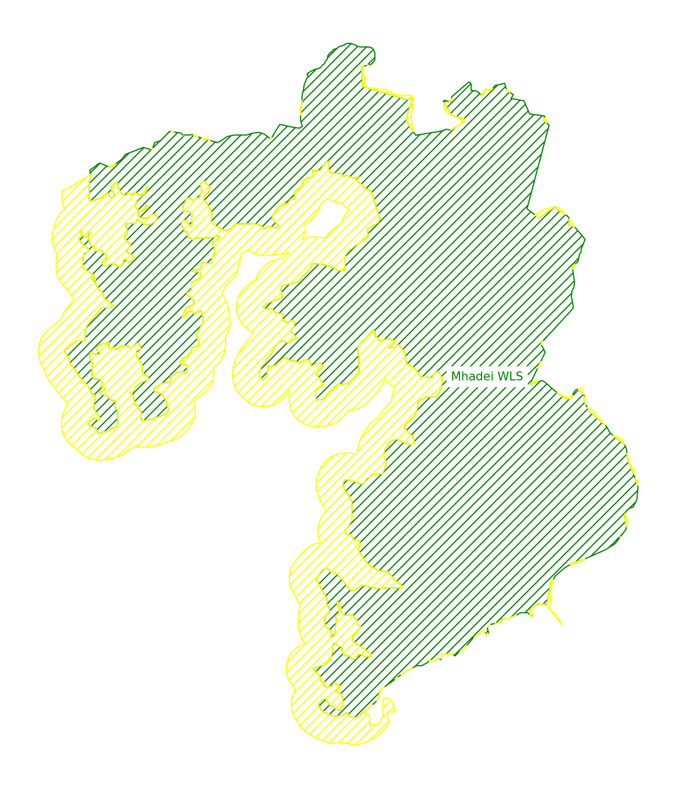
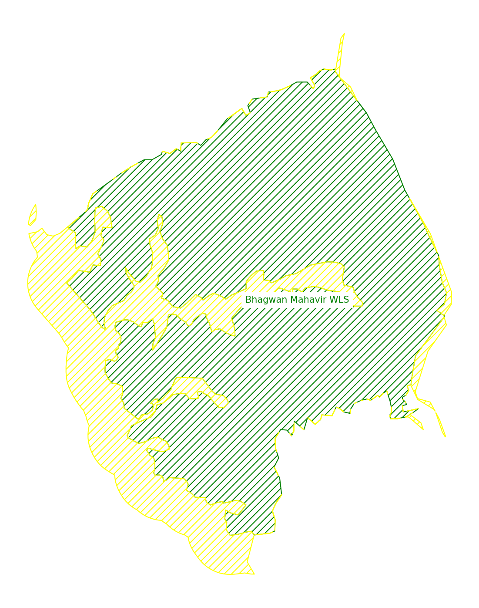
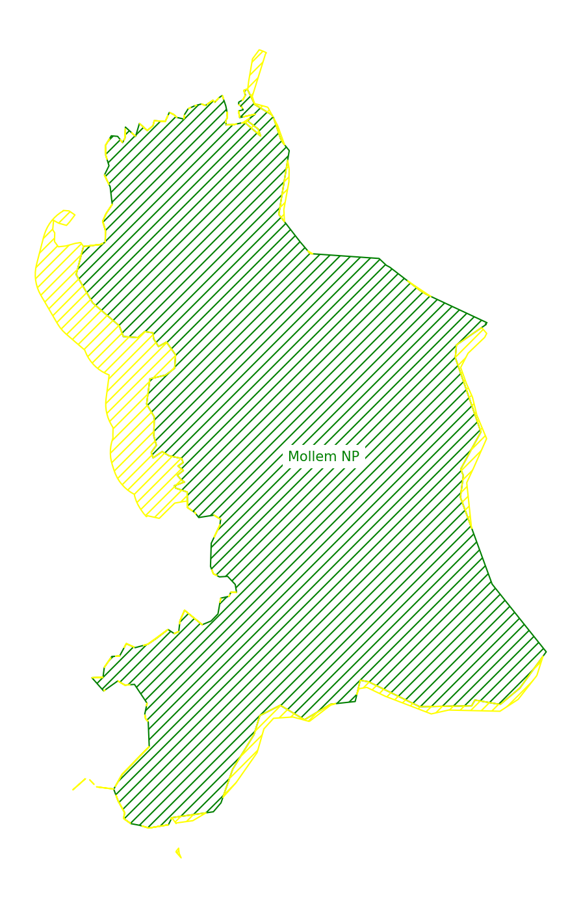
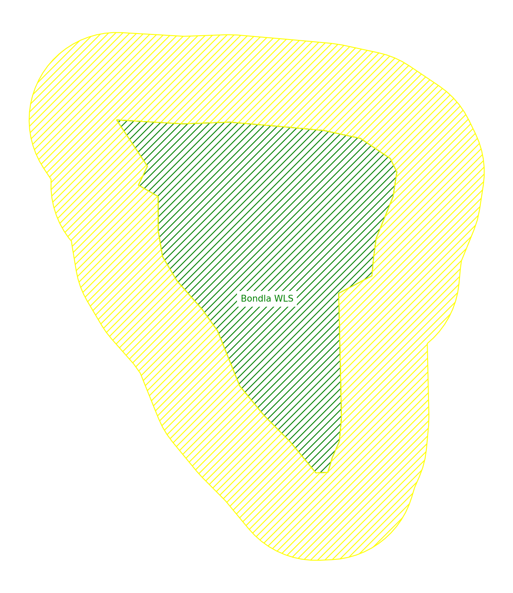
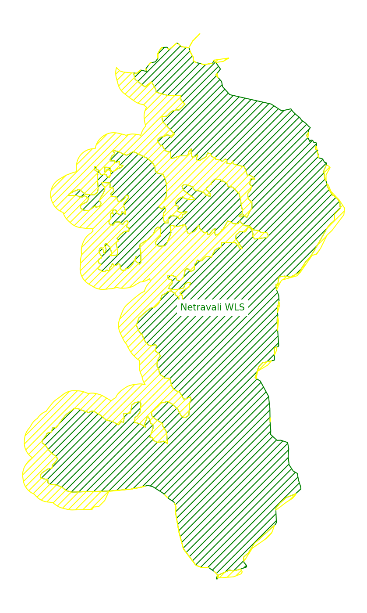
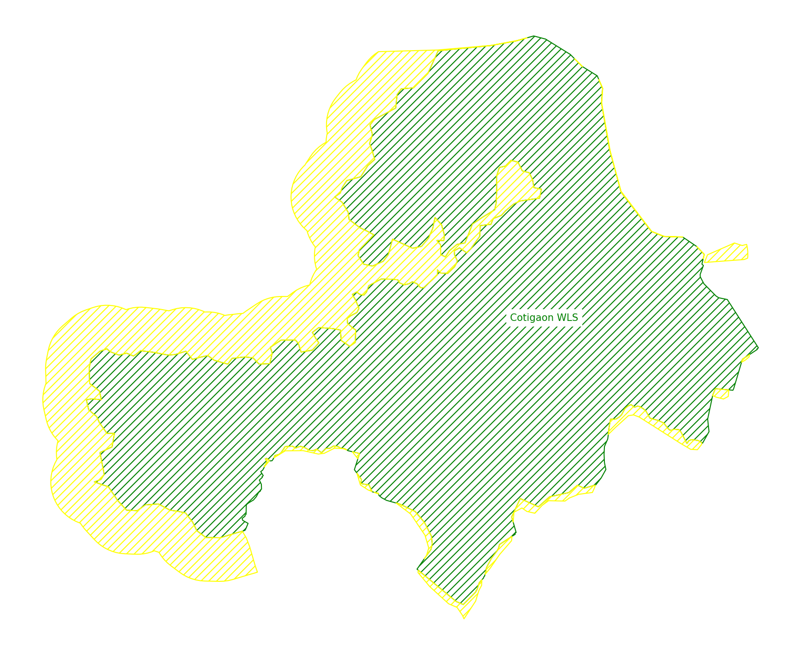
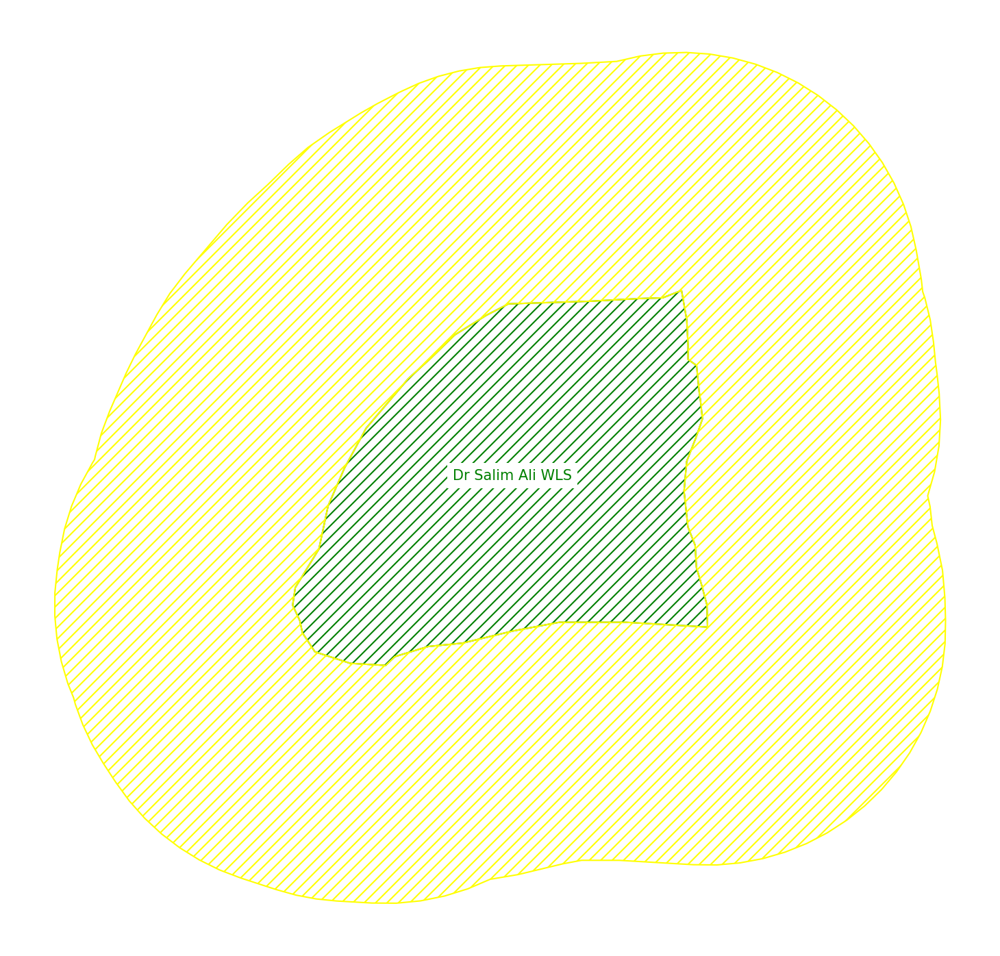

# Data preparation methods

The following data preparation was done in Python using the following packages and libraries:

- geopandas
- matplotlib
- glob

I used the interactive shell IPython as it allows for a richer visual experience and provides methods for previewing maps and graphs.

Data is drawn from:

- _Who made the PA polygons?_
- [the SHRUG](https://www.devdatalab.org/shrug)

## 1 - Protected area, buffer & village/town polygons

### 1.1 - Protected area & buffer polygons

In order to capture meaningful land cover changes we first need to create useful polygons to define areas of interest. I started with the shapefile "Notified_PA_Goa" created by \_\_\_\_ for each of the 7 notified protected areas:

1. Mhadei Wildlife Sanctuary
2. Bhagwan Mahavir Wildlife Sanctuary (N)\*
3. Mollem National Park
4. Bhagwan Mahavir Wildlife Sanctuary (S)\*
5. Bondla Wildlife Sacntuary
6. Netravali Wildlife Sanctuary
7. Cotigaon Wildlife Sanctuary
8. Dr. Salim Ali Wildlife Sanctuary

\* as per the shapefile Bhagwan Mahavir Wildlife Sanctuary is made up of 2 non-contiguous polygons. They will be treated independently for this analysis.

```
import geopandas as gp

pas = gp.read_file('data/Goa_protected_areas/Notified_PA_Goa.shp')

pas.columns.to_list()
Out[3]: ['Shape_Leng', 'Shape_Area', 'Name', 'geometry']

pas = pas.drop(columns=['Shape_Leng', 'Shape_Area'])

pas.Name
```

In order to consistently reference a single polygon the "Name" column of the dataset needs to be unique.

```
pas = pas.rename(columns={'Name': 'name'})

pas = pas.reset_index()

pas['index'] = pas['index'].astype(str)

pas['name'] = pas['index'] + '_' + pas['name'].str.replace(' ', '_').str.replace('.', '')

pas.name
```

Since all the areas of interest lie within the state of Goa, I have chosen to use the coordinate reference system [EPSG:7779](https://spatialreference.org/ref/epsg/7779/).

The "geometry" column represents the boundaries of the PAs not including the 1,000 m buffers. Therefore, the buffers would be the set of polygons extending from the current geometry columns outward 1,000 m. The polygons include a Z axis which is not relevant for the current analysis.

```
pas = pas.rename(columns={'geometry': 'pa'})

pas['pa'] = pas['pa'].force_2d()

pas = pas.set_geometry('pa')

pas = pas.to_crs('EPSG:7779')

pas['buffer'] = pas['pa'].buffer(1000)

pas['buffer'] = pas['buffer'].difference(pas['pa'])
```

The buffers constructed above do not take into account the fact that most of the PAs are contiguous and along Goa's eastern border. The buffers overlap each other, other PAs or fall outside the state. They need to be clipped account for these inconsistencies.

The state's boundaries are taken from [the SHRUG](https://www.devdatalab.org/shrug) and preprocessed to include only the polygon representing Goa in the correct CRS.

```
state = gp.read_feather('feathers/admin_units/state.feather')

state.index.names

state.columns.to_list()

pas['buffer'] = pas['buffer'].intersection(state.loc['30', 'geometry'])

pa_polygon_list = pas['pa'].to_list()

for pa_polygon in pa_polygon_list:
     pas['buffer'] = pas['buffer'].difference(pa_polygon)
```

**ISSUE** The buffers also intersect with themselves. For any analysis done on a per PA basis this will not have an impact. However, any analysis done on a state-wide basis will include some double counting for the area within the intersection of the buffers.

Mapping these polygons give the follwing state-wide and per PA maps.

```
import matplotlib.pyplot as plt

fig, ax = plt.subplots(layout='tight', num='State-wide')

plt.axis('off')

state.plot(ax=ax, linewidth=0.5, ec='grey', fc='none', linestyle='--')

ax.annotate(text='Goa', xy=state.loc['30'].geometry.representative_point().coords[0], ha='center', wrap=True, color='grey', fontsize='medium', bbox={'fc':'white', 'ec':'none'})

pas['pa'].plot(ax=ax, fc='none', ec='green', hatch='///')

pas['buffer'].plot(ax=ax, fc='none', ec='yellow', hatch='///')

def add_names(row):
    text = ' '.join(row['name'].split('_')[1:])
    pa = gp.GeoSeries(row.pa)
    rep_point = pa.representative_point().get_coordinates().values[0]
    ax.annotate(
        text=text,
        xy=(rep_point[0], rep_point[1]),
        ha='center',
        wrap=True,
        color='green',
        fontsize='medium',
        bbox={
            'fc':'white',
            'ec':'none',
        },
    )

pas.apply(add_names, axis=1)

// Uncomment below to save the state-wide png
// fig.savefig('pngs/state_wide_pas_buffers.png', dpi=150, format='png', bbox_inches='tight')

filenames = ('pngs/' + pas['name'] + '.png').to_list()

pa_names = [' '.join(name_parts[1:]) for name_parts in pas['name'].str.split('_').to_list()]

pa_polygons = pas['pa'].to_list()

buffer_polygons = pas['buffer'].to_list()

figs = []

for pa, buffer, name, fname in zip(pa_polygons, buffer_polygons, pa_names, filenames):
    fig, ax = plt.subplots(layout="tight", num=fname)
    plt.axis("off")
    pa_gp = gp.GeoSeries(pa)
    pa_gp.plot(ax=ax, fc='none', ec='green', hatch='///')
    gp.GeoSeries(buffer).plot(ax=ax, fc='none', ec='yellow', hatch='///')
    rep_point = pa_gp.representative_point().get_coordinates().values[0]
    ax.annotate(
        text=name,
        xy=(rep_point[0], rep_point[1]),
        ha='center',
        wrap=True,
        color='green',
        fontsize='medium',
        bbox={
            'fc':'white',
            'ec':'none',
        },
    )
    figs.append(fig)

// Uncomment below to save all individual PA and buffer maps
// for fig, fname in zip(figs, filenames):
    fig.savefig(fname, dpi=150, format='png', bbox_inches='tight')
```











### 1.2 - Village/town polygons

Village/town polygons are taken from [the SHRUG](https://www.devdatalab.org/shrug).

```

```
